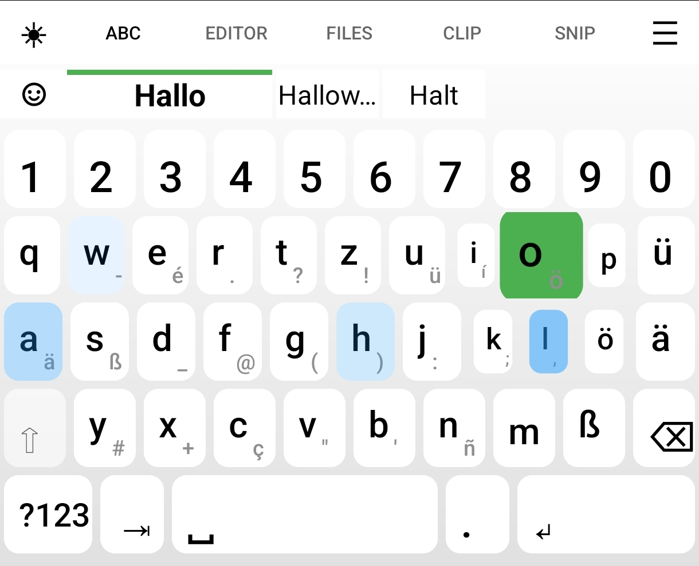
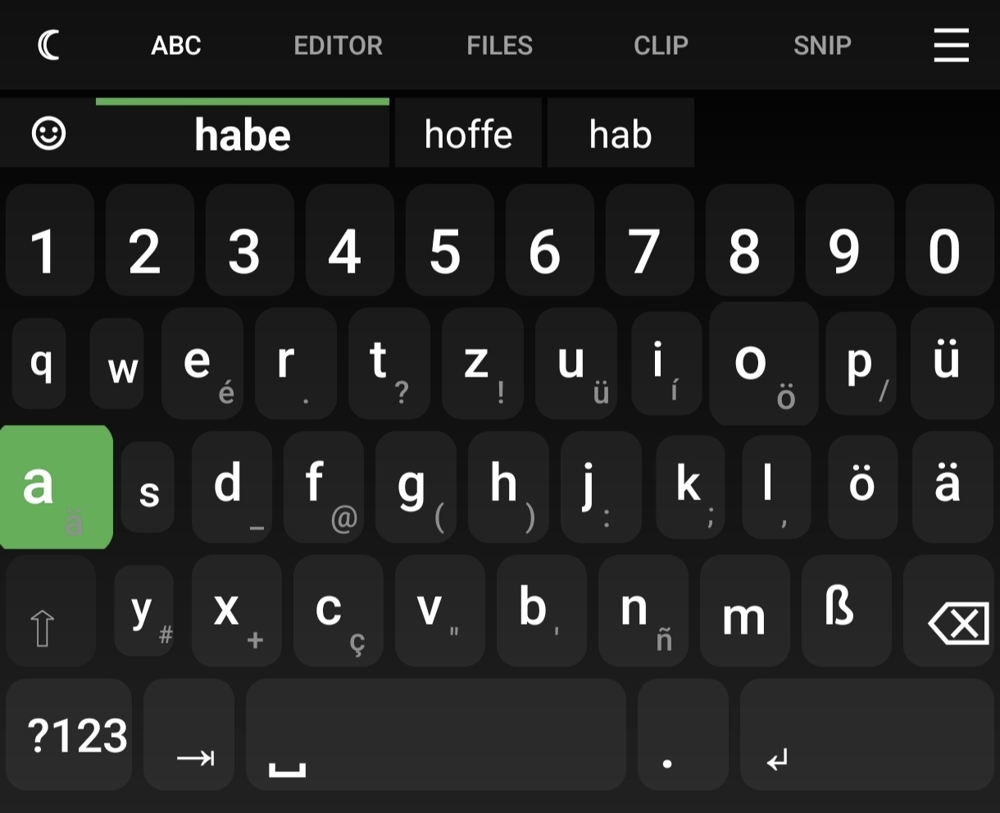
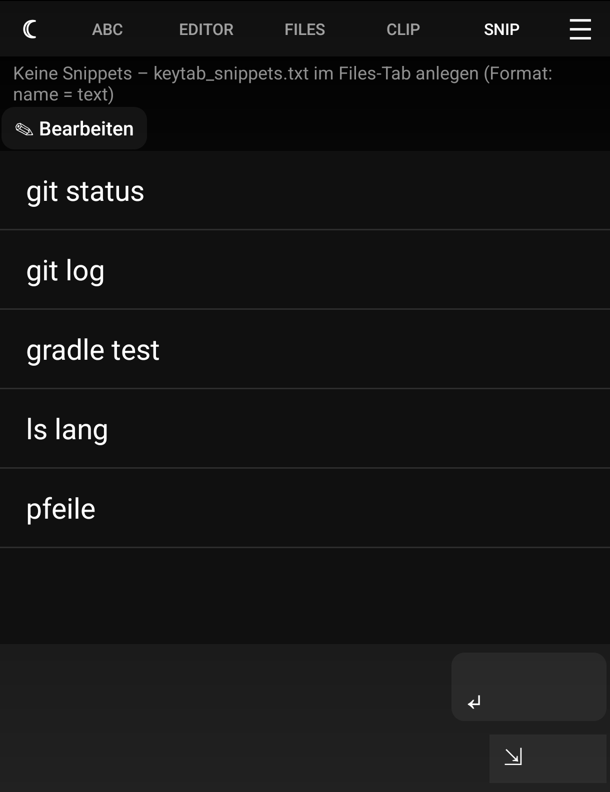
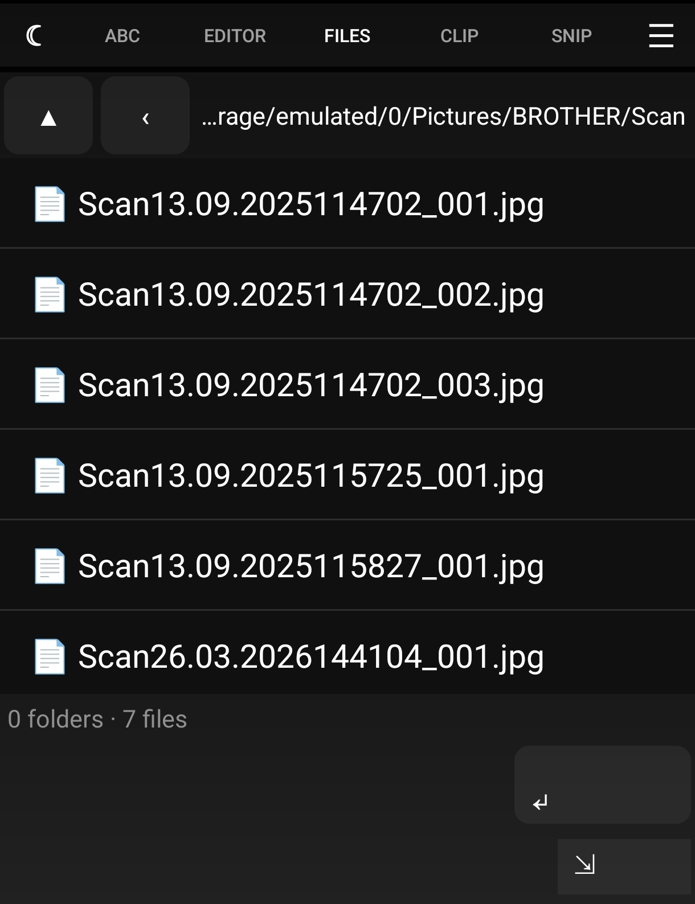
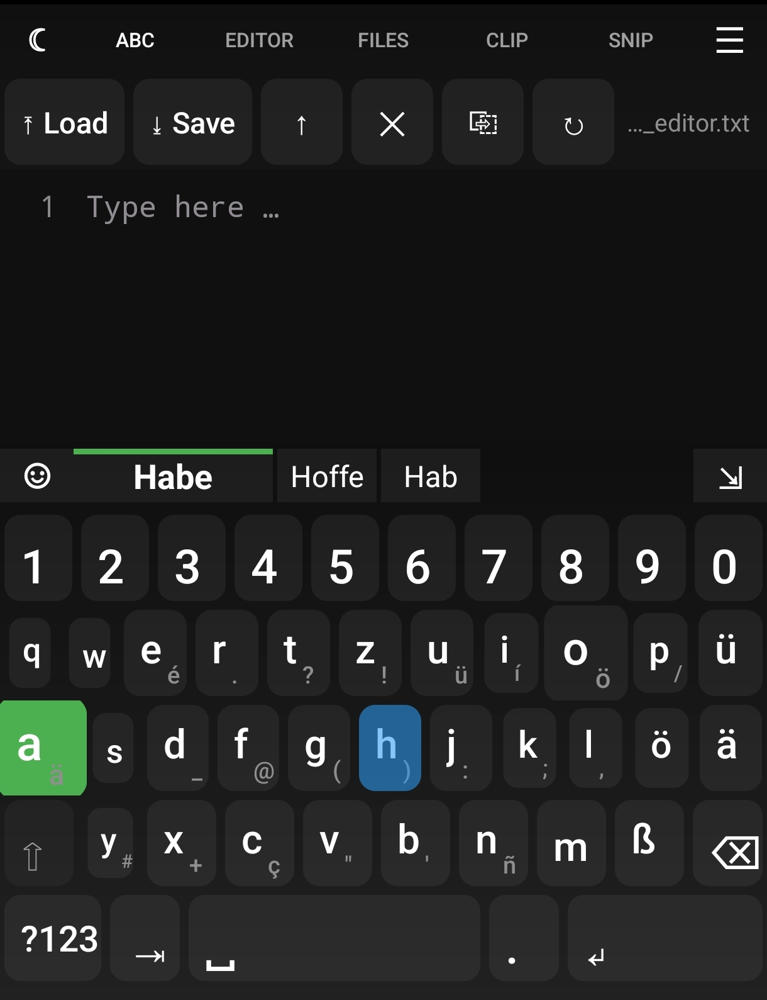
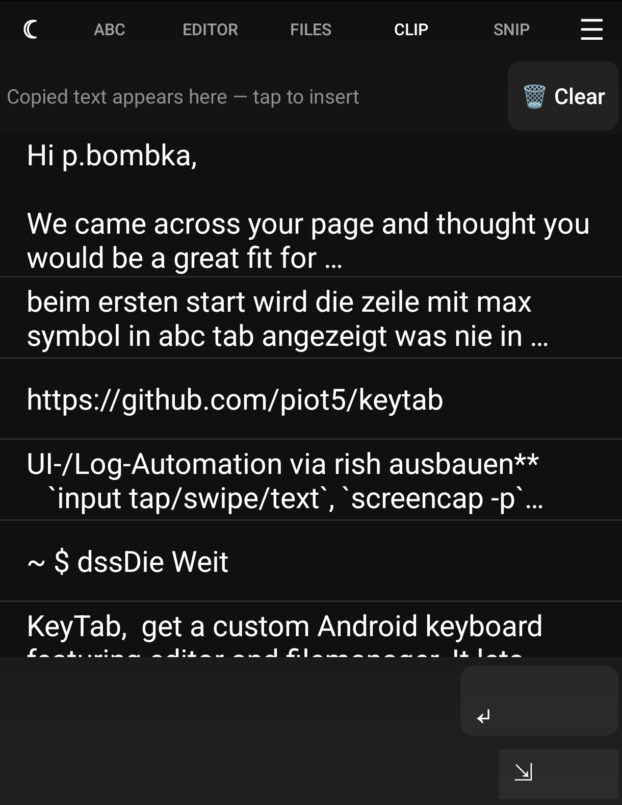
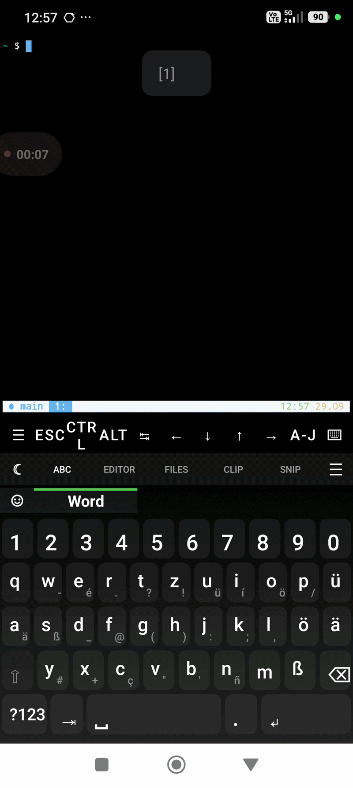

# KeyTab

[](https://github.com/piot5/keytab/actions/workflows/ci.yml)
[](https://github.com/piot5/keytab/actions/workflows/release.yml)
[](https://github.com/piot5/keytab/releases/latest)
[](https://github.com/piot5/keytab/releases)
[](https://github.com/piot5/keytab/stargazers)
[](https://github.com/piot5/keytab/issues)
[](https://github.com/piot5/keytab/pulls)
[](https://github.com/piot5/keytab/commits/main)
-3ddc84?logo=android&logoColor=white)

[](LICENSE)

Mobile IDE shaped like a keyboard (IME): a tabbed file manager, an editor/clipboard, snippets, with offline word prediction. 100% Kotlin, builds with Gradle.

## Download & Installation

[](https://github.com/piot5/keytab/releases/latest)

Every tagged release (`v*`) is built and published automatically by CI as a signed APK with SHA-256 checksum.

**Install:** open the APK in a file manager (allow "install unknown apps"), then enable KeyTab in *Settings → System → Languages & input → On-screen keyboard* and switch to it in any text field.

| Channel | Status |
|---|---|
| GitHub Releases | ✅ every `v*` tag, built and published by CI |
| IzzyOnDroid | ⏳ requested 2026-10-05 — [issue #672](https://codeberg.org/IzzyOnDroid/repodata/issues/672) is open (see [`docs/IZZYONDROID_SUBMISSION.md`](docs/IZZYONDROID_SUBMISSION.md)) |
| F-Droid | ⏳ requested — [merge request !50822](https://gitlab.com/fdroid/fdroiddata/-/merge_requests/50822) is open; reproducible build verified (see [`docs/FDROID_SUBMISSION.md`](docs/FDROID_SUBMISSION.md)) |

Release history lives in **[CHANGELOG.md](CHANGELOG.md)**.

## Screenshots

Real captures from the running app on a device (not mockups):

| Light theme (QWERTZ, de) | Dark theme (default) | Snippets tab |
|---|---|---|
|  |  |  |

| Files tab | Editor tab | Clipboard |
|---|---|---|
|  |  |  |

A short GIF demo of typing with suggestions: 

The top suggestion is rendered 2× wider with a green accent bar, the likely next key is scaled up (dynamic key sizing), and at a sentence start with no word typed the bar falls back to your last used snippets.

## What it does

KeyTab is a **mobile IDE built as an IME**: every feature lives in its own tab on the keyboard strip, so the keyboard itself is the launch point for a *local‑first* dev environment — open the file manager, editor, snippets directly, and what you type still lands in the app field you're in. If you work from Termux/Ubuntu‑proot, the keyboard becomes your shell launcher, file browser and snippet library in one input view.

**This is deliberately not an AI keyboard and not a cloud service:** everything runs fully on-device — offline n-gram word prediction (FrequencyWords corpora, CC-BY-SA-4.0) with Damerau-Levenshtein fuzzy correction in the suggestion bar, a learning user dictionary, prefix autocomplete, case matching, and a 50 ms-per-keystroke performance budget that keeps prediction off the main thread. There is **no network permission and no data collection**; `allowBackup="false"`, storage permissions are feature-mapped and minimal (`READ_EXTERNAL_STORAGE` for the file browser on API ≤ 32, `READ_MEDIA_IMAGES` for images/background decoding).

**Features at a glance:**

- **File manager in the keyboard** — browse folders with back-stack and parent-navigation, each tab remembers its own directory. Tapping a file inserts its path; in the app it opens via VIEW-Intent. Async listing so large folders don't freeze the UI.
- **Notes tab** — editor and clipboard merged into one tab: folder-browser loading, persistent clipboard history (50 entries) with picker dialog.
- **Snippets tab** — named commands as `name = text` lines in a plain-text file (`keytab_snippets.txt`, `#` comments, `\n` expanded); tap inserts, long-press previews, ＋/✎ add or edit inline. **Snippet suggestions** appear as chips when no word prediction is available at a sentence start (last 3 used).
- **Swipe typing** (optional) — route scored against the same offline engine; clear winners auto-commit, otherwise candidates appear in the bar; likely next keys light up along the route. See [`docs/SWIPE_PLAN.md`](docs/SWIPE_PLAN.md).
- **Dictionary maintenance** — in Settings, the learned dictionary can be scanned for artifacts and cleaned with explicit confirmation (preview first, base corpus untouched, entirely on-device).
- **Dynamic key sizing + likely highlighting** — likely-next keys scale up (grades 1.30×/1.15×, shrink 0.85×/0.925×) and glow in an adjustable colour; reaching the top suggestion fires a pulse (colour flash + haptic). Both toggleable.
- **Typing trail + suggestion-match marking** (optional) — last keys tint and fade (3/5/7/10 steps, drawn as key *foreground* overlay); with the trace on, letters turn green when the typed word matches the top suggestion. Typos stay unmarked (no red). Pure logic in `TrailLogic`, unit-tested.
- **Emoji catalog** — offline keyword→emoji catalog (de/en) behind the ☦ button, browsable page by page or as a full grid; insertion does not disturb n-gram learning.
- **Theme customization** — long-press the tab/☾ key (or open it from app settings): dark/light, gradient presets or fully custom background/key/highlight/text colors per theme via color wheel (hue/saturation), brightness and alpha sliders, plus a background image (fit/cover/stretch). Built-in dark theme: `#1a1a1a` background, `#2e2e2e` keys.
- **Keyboard essentials** — `KEYCODE_TAB` for Tab-completion in Termux/SSH, shift/caps-lock, long-press accent popups, accelerating backspace (250 ms → 30 ms).
- **Multi-language** — 7 latin-script languages (de, en, es, fr, it, pt, nl), each with its own frequency corpus and accent popups; instant switching with on-the-fly engine reload.

**Privacy in sensitive fields is enforced in code, not by preference** (`TrailLogic.isTrailAllowed` / `.isPersonalizedProcessingAllowed`): in password fields and whenever an app sets `IME_FLAG_NO_PERSONALIZED_LEARNING`, trail, swipe, suggestions and dictionary learning are all suppressed — a visual side channel or a learned password fragment cannot happen. Covered by unit tests with positive controls in normal fields, so the rule cannot be silently weakened into a dead `return`.

## Architecture

`KeyTabImeService` is the keyboard core (351 lines of orchestration). Every feature lives in its own class — panels for UI, controllers for stateful wiring, pure modules for logic (Android-free, unit-testable). All five panels receive narrow dependencies (`Context`, `Executor`, `Handler`, callbacks) and **none of them references `KeyTabImeService`**, which makes them directly unit-testable with Robolectric and no service mock. Panels use the shared main handler for UI updates; background work goes through the shared `KeyTabExecutors.io` / image executors, `ClipboardPanel` persistence is lifecycle-aware coroutine work with stale results discarded on navigation. The full file tree with per-class responsibilities is in [Project structure](#project-structure).

## Tests

Unit tests run via `./gradlew :app:testDebugUnitTest` (Robolectric for Android-dependent panels). The pure-logic classes (`SuggestionEngine`, `TextEditLogic`, `KeyScaleLogic`, `CapsLogic`, `LiftSpan`, `LikelyHighlightLogic`, `TrailLogic`, `PanelHeights`) are fully Android-free and fast.

**515 unit tests in 54 suites, 0 failures** (verified 2026-10-01, `testDebugUnitTest` + `koverVerify` green):

The largest suites: `SuggestionEngineTest` (33), `SwipePathLogicTest` (23), `PanelHeightsTest` (22), `SwipeManagerTest` (20), `TextEditLogicTest` (20), `SwipeScorerTest` (19), `TrailLogicTest` (19), `FileManagerModelTest`/`SuggestionControllerTest`/`SuggestionReplaceLogicTest` (17 each) — plus 41 further suites down to `TrailPerformanceTest` (1).

Test code is 7,652 lines in 54 files against 10,931 lines of main code (75 files) — a **70.0 % test-to-main ratio**. Line coverage measured with Kover is **70.8 %** (`LINE` 3228/4561), branch coverage **55.7 %** (`BRANCH` 1775/3186); the CI gate is **60 % line / 45 % branch** (hard `koverVerify`, re-measured 2026-09-28). Per package: the Android-free logic (`com.piotv.keytab.ime`: 71.8 %), the theme UI sections (`sections`: 94.1 %) and the in-app file manager (`file`: 77.4 %) — the latter two were historically untested and are now covered by `SectionsTest`, `SectionsMoreTest`, `EditorPanelTest`, `ClipboardPanelTest`, `SnippetPanelTest`, `FileManagerPanelTest`, `FileManagerFragmentTest` and `LearnedDictionaryApiTest`; remaining gaps are listed under [Known gaps](#known-gaps). The keyboard hot paths (correction trace → `knowsWord`, swipe sampling → `charAt`/`dedup`, swipe scoring) are JVM-benchmarked in `TrailPerformanceTest` and `SwipePerformanceTest` (avg µs per call, asserted far below the 50 ms keystroke budget). Test names are written as specifications in German (e.g. `Doppel-Tap aktiviert CapsLock`). Frame timing is measured on-device with `scripts/device_perf.py` (Shizuku/rish, `dumpsys gfxinfo`, target: the debug `ImeTargetActivity`'s plain text field). Re-measured 2026-09-29 with a verified setup and median-of-runs methodology (see [`docs/DEVICE_PERF.md`](docs/DEVICE_PERF.md)): **backspace-autorepeat PASS** — 400 ms repeat bursts into a filled field, 3 runs, median Jank@60 1.3 % (≤ 10 %), p50 5 ms / p95 13 ms, UI-thread p95 3.2 ms. The earlier "FAIL" (61 % Jank on 36 frames from 2 events) was a measurement artifact. **Typing (empty field, active predictions, 192 events) is thermal-state dependent**: 3.4 % Jank@60 at 34.1 °C battery temperature (PASS) vs. 39–42 % at ≥ 35.1 °C (FAIL) on the identical workload — a device throttling threshold, not app behavior; single-run numbers without a thermal log are not usable as a gate. UI-thread p95 stays ≤ 6.4 ms in every scenario (deadline misses are draw-side, not logic-side). The instrumented suite is **one** comprehensive typing test (`KeyTabTypingTest`): a single pass through every typing function of the real IME — long standard text, number row, symbol layer (`?123`), long-press extra picker, backspace, space, dot, Enter, TAB, Shift and the password field (types normally, shows no suggestions). Each step has its own expected result, so a failure names the typing function that broke. It runs in CI on an API-34 emulator via `scripts/run_instrumented_tests.sh` (build/install outside the budget, then `am instrument` with a hard **3-minute budget**, `TEST_BUDGET_S`, default 180). Device-first: run it on a real device **before** a push (`scripts/test_on_device.sh`, `-e runner true` shows the test-runner panel in the debug host) — the CI emulator is much slower and produces flakes that real hardware does not. Measured 2026-10-06: ~50 s on the CI emulator (well inside the 180 s budget) and 42–60 s on a real device.

```bash
# Run all unit tests
sh ./gradlew :app:testDebugUnitTest

# Run only the Android-free logic tests (fast, no Robolectric)
sh ./gradlew :app:testDebugUnitTest --tests "com.piotv.keytab.ime.SuggestionEngineTest" --tests "com.piotv.keytab.ime.TextEditLogicTest" --tests "com.piotv.keytab.ime.KeyScaleLogicTest" --tests "com.piotv.keytab.ime.KeyTabConfigTest"

# Run a single test class
sh ./gradlew :app:testDebugUnitTest --tests "com.piotv.keytab.ime.SuggestionEngineTest"
```

## Known gaps

Documented honestly rather than implied away — these are the things that are **not** verified or covered:

| Gap | Detail |
|---|---|
| **Trail frame timing measured on device (backspace PASS, typing thermal-dependent)** | The correction trace classifies the typed word against the engine on **every keystroke** (`TrailLogic.classifyTypedWord` → `SuggestionEngine.knowsWord`). Algorithm cost is JVM-benchmarked in `TrailPerformanceTest` — ~2 µs per classification on a 6,000-word corpus, ~4 orders of magnitude below the 50 ms keystroke budget (hard assertion). **Device frame timing re-measured 2026-09-29 with median-of-runs** (`scripts/device_perf.py --pkg com.piotv.keytab.debug`, 120 Hz panel, see [`docs/DEVICE_PERF.md`](docs/DEVICE_PERF.md)): backspace-autorepeat **PASS** (median Jank@60 1.3 %, p50 5 ms / p95 13 ms, UI p95 3.2 ms; the historical "FAIL" of 61 % came from only 2 events = 36 frames). Typing stays **thermal-state dependent** (3.4 % Jank@60 cool vs. 39–42 % above 35.1 °C battery temperature, same workload). What remains open: visual smoothness of the trail overlay and red/green trace contrast per theme palette (still not screenshot-verified). |
| **Trail visuals not screenshot-verified** | The regression fix for contradictory trace states (see 0.9.7) is proven at the **state level** by unit tests — no screenshot or instrumented test asserts the rendered colours. The red/green contrast against each custom theme palette has not been measured. |
| **Swipe frame timing not measured on device** | The swipe hot path (`charAt` + `dedup` per Move-Event, `SwipeScorer.score` on release) is JVM-benchmarked in `SwipePerformanceTest` — `charAt` and `dedup` are asserted < 5 ms avg over 10 000 calls, the scorer < 50 ms on a 6 000-word corpus (hard assertions so regressions fail the build). What remains open: **frame timing on a real display** (profiling the overlay invalidate + edge redraw on the device) and visual smoothness of the likely-keys path during an active swipe. |
| ~~English locale incomplete~~ **Resolved 2026-09-21** | `values-en` now covers all strings (was 92/163); no German fallback in English-locale devices any more. |
| **Instrumented coverage is one broad pass** | The real IME contract is checked by a single pass (`KeyTabTypingTest`): long standard text, number row, symbol layer, long-press extras, backspace, space, dot, Enter, TAB, Shift, and the password / no-personalised-learning fields. Verified green in CI (API-34 emulator) and on a real device (2026-10-06). Visual rendering (themes, trail colours) is still not screenshot-asserted — the doc-capture tools (screenshots/GIFs/showcase videos) were dropped: they were recording scripts, not tests. |

## Icon

The launcher icon (full-bleed) lives in `app/src/main/res/mipmap-*/`, with the
Fastlane store icon at `fastlane/metadata/android/en-US/images/icon.png`.
The exact colours are documented in [`docs/icon.md`](docs/icon.md).

## Build

KeyTab builds with Gradle on-device (Android 7+, API 24+). No Android Studio needed.

```bash
# Debug build
bash build_keytab.sh debug

# Release build (signed, with R8 minification)
bash build_keytab.sh release

# Install via Shizuku/rish
bash install_keytab.sh
```

### Building on Android (Termux/proot)

The bundled `gradlew` works in Ubuntu-proot on Android. Two caveats:

- The Gradle wrapper JAR is re-downloaded on first run (TLS can break in proot). If that fails, run Gradle once with a working network connection.
- Building directly on the SD card is unreliable (the Gradle daemon gets killed, FUSE file locks cause issues). Copy the project to internal storage and build there:
```bash
cp -r /path/to/keytab ~/build/
cd ~/build/keytab

# gradlew has no exec bit on FAT -- call it with sh
sh ./gradlew :app:assembleDebug --offline

cp app/build/outputs/apk/debug/app-debug.apk /path/to/keytab/app-debug-new.apk
```

Long-running builds should be started with `setsid … &` to avoid the terminal timeout killing the Gradle process. `--offline` saves time when no new dependencies are needed.

## Installation (without a PC, via Shizuku/rish)

Requires a running Shizuku server and the `~/bin/rsh` wrapper.

```bash
# Copy APK to /data/local/tmp (the shell cannot see /mnt/... paths)
sh ~/bin/rsh 'cp /sdcard/path/to/keytab/app-debug-new.apk /data/local/tmp/keytab.apk'

# Install (use -r for update)
sh ~/bin/rsh 'pm install -r /data/local/tmp/keytab.apk'
# -> "Success"

# Verify
sh ~/bin/rsh 'rm -f /data/local/tmp/keytab.apk; dumpsys package com.piotv.keytab | grep lastUpdateTime'
```

The easiest route is `sh install_keytab.sh <apk>` (staging to `/sdcard/Download`,
copy via Shizuku, `pm install -d -r`). `sh build_install.sh debug` does build + tests + install in one go.

### Important: debug vs. release package

| Build | Package | Use |
|---|---|---|
| `assembleDebug` | `com.piotv.keytab.debug` | Development only |
| `assembleRelease` | `com.piotv.keytab` | The real install |

Both register a keyboard. If the debug package stays installed and enabled, Android can keep using it — a stale debug build then looks like "the app did not change". Always check which one is active:

```bash
sh ~/bin/rsh 'settings get secure default_input_method'
# -> com.piotv.keytab/com.piotv.keytab.ime.KeyTabImeService   (release, correct)
# -> com.piotv.keytab.debug/...                            (old debug build)
```

To switch back to the release build:

```bash
sh ~/bin/rsh 'settings put secure enabled_input_methods com.piotv.keytab/com.piotv.keytab.ime.KeyTabImeService'
sh ~/bin/rsh 'settings put secure default_input_method com.piotv.keytab/com.piotv.keytab.ime.KeyTabImeService'
sh ~/bin/rsh 'pm uninstall com.piotv.keytab.debug'   # remove the stale build
```

See [`docs/RELEASE.md`](docs/RELEASE.md) for the full release process. Dependency checksums and the pinned GitHub Actions (plus how to update a pin) are documented in [`docs/SUPPLY_CHAIN.md`](docs/SUPPLY_CHAIN.md). Local gate runs and detekt baseline maintenance go through [`docs/BASELINE.md`](docs/BASELINE.md) (`sh scripts/baseline.sh --list`).

## Project structure

```
app/src/main/java/com/piotv/keytab/            # 75 Kotlin files
├── Prefs.kt                       # Central preference keys
├── MainActivity.kt                # Settings: enable keyboard, theme, language, toggles
├── ThemeSettingsActivity.kt       # Theme settings: color wheel, gradients, per-theme colors
├── ColorWheelView.kt              # HSV color wheel widget
├── file/FileManagerFragment.kt    # File manager in the app (with DiffUtil)
├── sections/                      # Theme settings page, split into section classes
│   ├── TopSection.kt              #   theme choice + gradient presets
│   ├── ColorSection.kt            #   color wheel + sliders
│   ├── GradientSection.kt         #   gradient preview
│   ├── BackgroundSection.kt       #   background image (fit/cover/stretch)
│   ├── LikelyHighlightSection.kt  #   likely-highlighting toggles
│   ├── TrailSection.kt            #   typing trail: on/off, steps, correction trace
│   └── PreviewSection.kt          #   live preview
└── ime/
    ├── KeyTabImeService.kt   # Keyboard core / orchestration (351 lines)
    ├── KeyboardHost.kt       # Interface consumed by the controllers
    ├── KeyboardViewFactory.kt # Builds the keyboard view tree
    ├── KeyboardBinder.kt     # Touch / long-press, backspace repeat
    ├── ShiftController.kt    # Shift / caps-lock state machine
    ├── TabController.kt      # Tab switching + uniform panel heights
    ├── SuggestionController.kt # Suggestion bar wiring
    ├── ThemeController.kt    # Theme long-press actions
    ├── TextCommitController.kt # commitText / commitToApp routing
    ├── ThemePrefs.kt         # Theme keys/presets + rebuild version
    ├── ThemeApplier.kt       # Recursive theme application on the view tree
    ├── BackgroundImage.kt    # Keyboard background image decoding
    ├── SettingsConfig.kt     # keytab_config.txt import/export
    ├── FileManagerPanel.kt   # IME file manager
    ├── EditorPanel.kt        # Notes editor with folder browser
    ├── ClipboardPanel.kt     # Clipboard history (picker dialog)
    ├── SnippetPanel.kt       # Snippets/commands tab with inline editor
    ├── WordPredictionManager.kt # Suggestion orchestration
    ├── DynamicKeyScaler.kt   # Maps suggestion scores to key sizes
    ├── SuggestionEngine.kt   # Pure word prediction (offline, unit-tested)
    ├── LanguageModule.kt     # Multi-language registry (7 latin scripts)
    ├── KeyScaleLogic.kt      # Pure scaling math (stepped grades)
    ├── TextEditLogic.kt      # Pure, testable text logic
    ├── EditorHighlightLogic.kt # Highlight rules for the notes editor
    ├── CapsLogic.kt          # Auto-capitalisation decision
    ├── RepeatScheduler.kt    # Backspace repeat timing
    ├── LikelyHighlightLogic.kt # Likely-next-key scoring
    ├── TrailLogic.kt         # Trail decay + correction-trace classification
    ├── TrailManager.kt       # Renders the trail as key foreground overlays
    ├── PanelHeights.kt       # Uniform panel heights
    ├── FileManagerModel.kt   # File-manager state (pure)
    ├── LetterPopup.kt        # Long-press characters + drag selection
    ├── KeyAnimations.kt      # Key press/scale animation helpers
    ├── ThemedAdapter.kt      # RecyclerView adapter with per-theme colors
    ├── KeyTabExecutors.kt    # Shared executor + main handler
    └── …                     # InputTargets, LiftSpan, KeyTabConfig

app/src/test/java/com/piotv/keytab/            # 54 test classes, 515 tests, 7,652 lines
app/src/androidTest/                           # 1 instrumented test, 631 lines (kompletter Tippdurchlauf, CI: API 34 emulator)
app/src/main/res/values/strings.xml            # 141 strings (default = German)
app/src/main/res/values-en/                    # English locale (141 strings — complete)
app/src/main/res/values-night/                 # Night-mode resource qualifiers
app/src/main/assets/
├── de_freq_top6000.txt              # corpus (CC-BY-SA-4.0)
├── en_freq_top6000.txt              # corpus (CC-BY-SA-4.0)
├── es_freq_top6000.txt              # corpus (CC-BY-SA-4.0)
├── fr_freq_top6000.txt              # corpus (CC-BY-SA-4.0)
├── it_freq_top6000.txt              # corpus (CC-BY-SA-4.0)
├── pt_freq_top6000.txt              # corpus (CC-BY-SA-4.0)
└── nl_freq_top6000.txt              # Dutch corpus (CC-BY-SA-4.0)
```
## Roadmap

Release history lives in **[CHANGELOG.md](CHANGELOG.md)**; the version is defined in exactly one place (`app/build.gradle.kts`) and is checked against changelog + fastlane notes by the CI job 'docs'.

1. **Finish the coroutine migration** — `ClipboardPanel` now uses a service-owned lifecycle-aware scope with `Dispatchers.IO`; `FileManagerPanel` and `SuggestionEngine` remain on the shared executor/manager path.
2. **PTY/Shell in der App** — der Terminal-Tab wurde in v0.14 bewusst entfernt: eine Shell ohne PTY/Userland war keine echte Arbeitsumgebung. Für Termine/SSH bleibt KeyTab die Eingabemethode; die Shell macht Termux.

Explicitly *not* planned: cloud sync, 100+ languages — those are Gboard dimensions that cannot be won here.

**Also not planned: an extra-keys row** (Esc/Ctrl/arrows). Termux already ships one (`extra-keys` in `termux.properties`), so a second row would duplicate it and eat key height.

## Contributing

Issues and pull requests are welcome. Before opening a PR:

```bash
sh scripts/check_docs_drift.sh                     # docs must match the code
sh ./gradlew :app:testDebugUnitTest --offline      # 515 tests must stay green
bash build_keytab.sh debug                         # must build
sh scripts/test_on_device.sh                       # instrumented typing test on a real device (before a push)
```

Conventions:

- 100 % Kotlin, no new dependencies without a clear reason.
- New logic goes into an Android-free, unit-tested class (a `*Logic` / model class); keep the panels and the service thin.
- Unit-test names are written as specifications (German is the established convention under `app/src/test`).
- Do not add an `INTERNET` permission — "no network, no data collection" is a core promise of the app.
- **Versioning**: the version lives only in `app/build.gradle.kts` (`versionCode`/`versionName`). Bump it there, move the fastlane release notes to `fastlane/metadata/android/en-US/changelogs/<versionCode>.txt` and add a matching section at the top of `CHANGELOG.md` — the CI job `docs` fails if any of the three drifts apart.
- **Test counts, file/line numbers and the structure block in this README** are verified by the same check (`scripts/check_docs_drift.sh`, sections 2/5/6), so update them when you add code — a stale number fails the CI job `docs`.

## License

MIT -- see [LICENSE](LICENSE)
